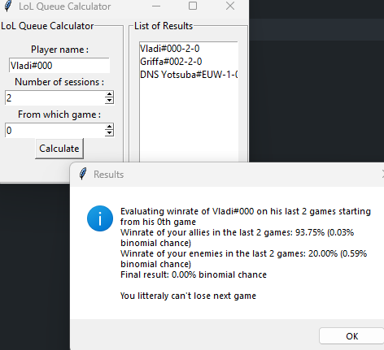

# LoL Queue Calculator

## Overview
This Python tool is designed for League of Legends (LoL) players to analyze the concept of winner and loser queues. It calculates and interprets history to determine if a player is likely in a winner's queue (where the chances of winning are higher due to unknown factors) or a loser's queue. By assessing recent game win rates the tool aims to provide insights into a player's current matchmaking status.


## Installation

1. Clone the repository:
   ```bash
   git clone https://github.com/noahkohrs/LoLQueueEvaluator
   ```
2. Install required packages:
   ```bash
   pip install -r requirements.txt
   ```
3. Set up `.env` file with your Riot Games API key:
   ```
   YOUR_LOL_API_KEY='<your-api-key-here>'
   ```

## Usage

Run the script.

Example:
```python
python main.py
```

This will open a GUI that looks like this:




## Credits

Thanks to [Riot Games](https://developer.riotgames.com/) for providing the API used in this project.


## Authors
- [Arthur Mermet](https://github.com/DNSJambon)
- [Noah Kohrs](https://github.com/noahkohrs)


## Disclaimers

This is a prototype and is not intended for serious use.

This project only currently works for EUW players. Feel free to fork and add support for other regions.

This is a personal project and is not endorsed by Riot Games. It is created for educational purposes.
